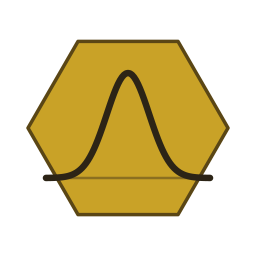

<p align="center">
  
</p>

# jwspecfit

**Emission-line fitting, MCMC, and chemical abundances for JWST NIRSpec spectra.**

[](https://pypi.org/project/jwspecfit/)
[](https://pypi.org/project/jwspecfit/)
[](LICENCE)
[](tests/)
[](https://jwspecfit.readthedocs.io/en/latest/)
[](https://doi.org/10.5281/zenodo.19679793)

Three packages, one pipeline — from 1-D NIRSpec spectra to element abundances.

| Package             | What it does                                                       |
| ------------------- | ------------------------------------------------------------------ |
| **`jwspecfit`**     | Resolution-aware Gaussian line fitting with bootstrap errors       |
| **`jwspecmcmc`** ⭐ | Bayesian MCMC fitting (NUTS · emcee · nautilus) — **recommended**  |
| **`jwspecabund`**   | Chemical abundances — direct T_e · forward model · strong-line     |

> **Recommended fitter:** for science-quality results the authors recommend the Bayesian MCMC fitter `jwspecmcmc` (full posteriors and faithful uncertainties). Use the least-squares `jwspecfit` engine for quick looks, initial guesses, and BIC model selection.

## Key features

- **Resolution-aware line profiles**: bin-averaged Gaussians via erf — correct for prism, gratings, and stacks.
- **Broad-Balmer detection**: BIC-based selection across four nested models.
- **UV doublets**: flux-ratio and kinematic tying for C IV, N V, N III], O III], C III], N IV].
- **Lyα + DLA**: skewed Gaussian + IGM transmission + dynesty N_HI retrieval.
- **Dust correction**: multi-Balmer A_V anchored on Hβ **or** Hα, Salim+18 or Cardelli+89 curves.
- **Abundances**: direct T_e ([O III] 4363 or UV 1666), Cullen+25 forward model, Sanders+25 strong-line.
- **ICFs**: Martinez+25 (N/O) · Izotov+06 (S, Ne, Ar) · Garnett+97 (C/O).
- **Lyα escape fraction** with Monte Carlo propagation of A_V uncertainty.

## Install

```bash
pip install jwspecfit
```

Or with all optional extras (MCMC backends, abundances, DLA fitter):

```bash
pip install "jwspecfit[nuts,mcmc,abund,dla]"
```

For development (editable install from source):

```bash
git clone https://github.com/raunaq-rai/jwspecfit.git
cd jwspecfit
pip install -e ".[dev,nuts,mcmc,abund]"
```

Requires Python ≥ 3.10. See the [installation guide](https://jwspecfit.readthedocs.io/en/latest/installation.html) for individual extras.

## Example

```python
import jwspecfit, jwspecabund

spec   = jwspecfit.read_fits("spectrum.fits", z=6.0)
result = jwspecfit.fit_lines(spec, z=6.0)
abund  = jwspecabund.compute_abundances(result, z=6.0)

print(abund.summary())
```

## Line fitting

The recommended fitter is the Bayesian `jwspecmcmc` engine sampled with NumPyro
NUTS:

```python
import jwspecmcmc

result = jwspecmcmc.fit_lines(spec, z=6.0, sampler="nuts")
```

### Model and parameters

The continuum is first estimated with a low-order polynomial fitted to the
spectrum after masking the regions around known emission lines and iteratively
rejecting positive outliers, and is then subtracted. Each emission line is
modelled as a resolution-aware Gaussian, integrated over the wavelength range
spanned by each spectral pixel (via the error function) so that the model is
compared to the data on the same footing for the prism, the gratings, and
stacked spectra alike. The line model is the sum of these Gaussians on top of
the fitted continuum.

For every line three parameters are fit: an amplitude (the integrated line
flux), a central wavelength, and a Gaussian width. Physically related
transitions are tied to reduce the dimensionality and to respect atomic physics:
the Balmer series can share a common velocity and width with the bright
rest-optical lines (e.g. [O III] λ5007), doublets share kinematics, and
unresolved doublets are held at fixed or bounded flux ratios. Centroids and
widths are bounded to physically motivated ranges set by the instrumental
resolution and a maximum velocity offset from the systemic redshift.

### Sampling and inference

Inference is fully Bayesian: full posteriors are obtained via Markov Chain Monte
Carlo using a Gaussian likelihood (identical to the weighted chi-squared used by
the least-squares engine, so both fitters treat the data identically) with
uniform priors over the parameter bounds. Sampling uses the No-U-Turn Sampler
(NUTS), a self-tuning variant of Hamiltonian Monte Carlo. The likelihood is
JIT-compiled in JAX and differentiated automatically, so the sampler uses the
gradient to propose distant, high-acceptance moves and explores the
high-dimensional parameter space far more efficiently than random-walk methods.

During warmup the step size is adapted to a target acceptance probability
(`target_accept_prob = 0.8`) and the trajectory length is bounded by a maximum
tree depth (`max_tree_depth = 10`), with the No-U-Turn criterion terminating
each trajectory automatically; there is no hand-tuned proposal scale. By default
the chain is run for 500 warmup (adaptation) steps followed by 2000 posterior
samples, initialised at a validated finite-likelihood seed (a least-squares
pre-fit) so that every transition starts in bounds.

Uncertainties on the line fluxes are taken as the 16th–84th percentiles of the
posterior, and all quantities are reported as posterior medians with the
corresponding credible intervals. The fit yields full posterior chains for every
parameter, including a posterior distribution of the integrated flux of each
line; these per-line flux posteriors are resampled by the downstream abundance
routines to propagate measurement uncertainties through the (non-linear)
abundance calculation.

Two other backends are available for cross-checks (`sampler="emcee"`, an
affine-invariant ensemble sampler, and `sampler="nautilus"`, an importance-nested
sampler), but NUTS is the default and recommended choice.

## Documentation

Usage guides, API reference, and methodology:
**https://jwspecfit.readthedocs.io/**

Worked examples: [`docs/notebooks/`](docs/notebooks/).

## Tests

```bash
pytest tests/
```

## Citation

If you use `jwspecfit` in your research, **please cite it**. Choose
whichever format your reference manager or journal prefers.

> ### 📖 DOI: [10.5281/zenodo.19679793](https://doi.org/10.5281/zenodo.19679793)
>
> Concept DOI — always resolves to the latest Zenodo-archived release.

### Plain text

> Rai, R. (2026). *jwspecfit: Resolution-aware emission-line fitting,
> MCMC sampling, and chemical abundances for JWST NIRSpec* (v1.0.1).
> Zenodo. <https://doi.org/10.5281/zenodo.19679793>

### BibTeX

```bibtex
@software{rai_jwspecfit,
  author       = {Rai, Raunaq},
  title        = {{jwspecfit}: Resolution-aware emission-line fitting,
                  MCMC sampling, and chemical abundances for JWST NIRSpec},
  year         = {2026},
  version      = {1.0.1},
  publisher    = {Zenodo},
  doi          = {10.5281/zenodo.19679793},
  url          = {https://doi.org/10.5281/zenodo.19679793},
}
```

### Other formats

APA · Chicago · IEEE · Harvard · MLA · CSL-JSON · DataCite XML are all
available from the [Zenodo record page](https://zenodo.org/records/19679793)
(Export panel on the right).

GitHub's **"Cite this repository"** button (top-right of the repo page)
reads [`CITATION.cff`](CITATION.cff) and produces APA/BibTeX on the fly.

### Pinning a specific version

The concept DOI above always points to the latest release. If a paper
needs to cite the *exact* code version used for reproducibility, pick
the per-version DOI from the "Versions" list on the Zenodo page.

## Licence

MIT — see [LICENCE](LICENCE).
